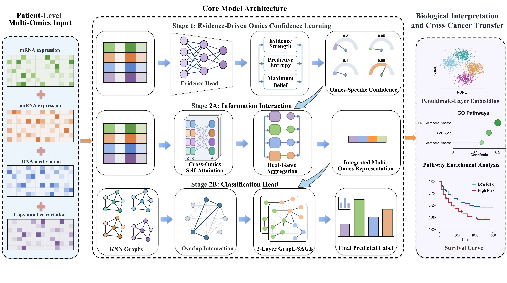

# CMGL

PyTorch implementation for "CMGL: Confidence-guided Multi-omics Graph Learning for Cancer Subtype Classification".

## Overview

In this paper, we propose **CMGL** (Confidence-guided Multi-omics Graph Learning), a two-stage deep learning framework for cancer subtype classification from multi-omics data. The first stage uses an evidential Multi-view Reliability Fusion (MRF) module to estimate per-view classification confidence; the second stage builds a confidence-gated graph fusion over a transductive kNN graph and performs GraphSAGE-based subtype prediction.

## Framework

<div align="center">
  
</div>

## Data

The datasets used in CMGL come from the **MLOmics** multi-omics cancer benchmark (Yang et al., 2025). 

## Usage

To reproduce the experiments:

1. Clone the repository and install the required packages

```bash
git clone https://github.com/fanboyang/CMGL.git
cd CMGL

pip install -r requirements.txt
```

2. Run the 5-fold BRCA experiment

```bash
python main_CMGL.py
```

Per-fold outputs and the aggregated 5-fold summary are written to `results/<timestamp>/`:

```text
results/<timestamp>/
├── fold1/
│   ├── predictions.csv
│   └── summary.json
├── ...
├── fold5/
└── 5fold_summary.json
```

## Project Structure

```text
CMGL
│
├── GS-BRCA/             # BRCA 5-fold splits (mRNA, miRNA, DNA methylation, CNV)
│
├── main_CMGL.py         # Entry point for the 5-fold experiment
├── train_test.py        # MRF and GNN training + warm-up k selection
├── models.py            # MRF, GNNStage, OmicsFusion, GraphFusion
├── losses.py            # EDL, label-smoothed CE, diversity, supervised contrastive
├── utils.py             # Graph construction, metrics, I/O
├── framework.pdf    # Framework overview figure
├── requirements.txt     # Python dependencies
└── README.md
```
